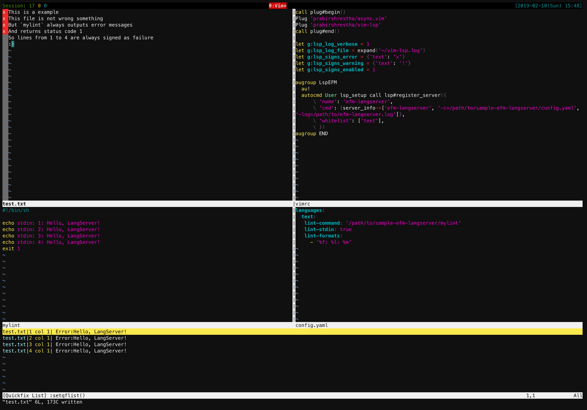

# efm-langserver example

This is an example of langserver using [mattn/efm-langserver](https://github.com/mattn/efm-langserver).



## Preparation

- install mattn/efm-langserver (`go get -u github.com/mattn/efm-langserver`)
- update config.yaml to adjust your environment
- for vim
  - install junegunn/vim-plug
  - update vimrc to adjust your environment

## Usage

### Vim

```
$ vim -N -u vimrc test.txt
```

